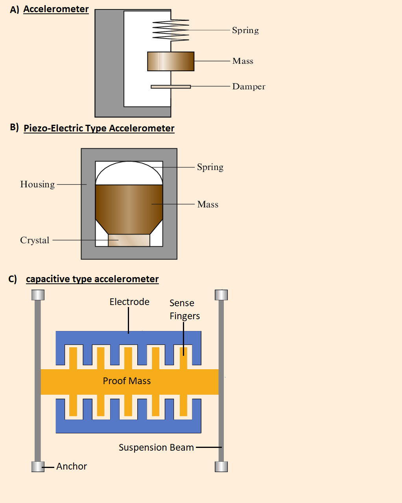
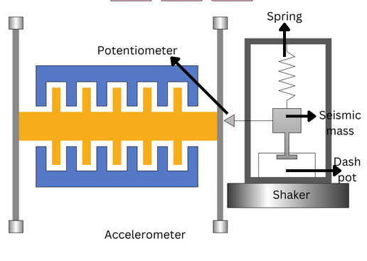

### Theory

An accelerometer is a device that measures the vibration, or acceleration of motion, of a structure. The force caused by vibration or a change in motion (acceleration) causes the mass to “squeeze” the piezoelectric material which produces an electrical charge that is proportional to the force exerted upon it. 

An accelerometer is a device that senses the different types of accelerations or vibrations. Acceleration is the change in velocity caused by the movements of a body. An accelerometer absorbs the vibrations created by the body and uses it to know the orientation of the body. A piezoelectric accelerometer has two types which are high impedance output accelerometer and low impedance output accelerometer. On the basis of the working mode, it is mainly of three types. The compression mode, the capacitive mode, and the shear mode. All of them work on sensing the vibrations.

There are several different types of accelerometers, each with its own working principle and advantages:

**Piezoelectric Accelerometers**
In this type the sensors are made of crystals or ceramics like lead zirconate, lead titanate, etc. This sensor absorbs the vibrations and produces the same amount of electrical signals. The construction of a piezoelectric accelerometer involves a sensing crystal to which a seismic weight is attached. When the sensor experiences an acceleration, the weight exerts a force on the crystal. The piezoelectric crystal converts the force acting upon it to electrical signals, which can be measured to find the acceleration. Piezoelectric accelerometers are highly effective at measuring shocks and vibrations.

**Capacitive Accelerometers**
In this type of accelerometer, the changes in capacitance are detected instead of a change in resistance. Most mobile devices use this MEMS accelerometer. Capacitive sensors work by changing their capacitance based on the acceleration they experience. Their construction involves two capacitive plates and a diaphragm. As the sensor experiences acceleration, the diaphragm moves and changes the distance between the capacitive plates. This results in the capacitance of the sensor to change, and this change in capacitance can be measured and translated to the rate of acceleration on the sensor. Capacitive MEMS (microelectromechanical system) accelerometers are used in most smartphones today.

**Piezoresistance Accelerometers**
A piezoresistance - or piezoresistive - accelerometer is a type of accelerometer that works by varying their resistance based on the acceleration they experience. The change in acceleration can be measured to understand the rate of acceleration experienced by the sensor. Piezoresistive accelerometers are less sensitive than piezoelectric accelerometers, as they are not best at measuring low-frequency impacts. However, they work best at high amplitudes and find their application in vehicle crash testing and weapons testing.

**Triaxial Accelerometers**
A triaxial accelerometer is a type of accelerometer that can measure acceleration in three orthogonal directions (or the three perpendicular planes – X, Y, and Z). This feature enables triaxial accelerometers to measure all the vibration components affecting the object. A triaxial accelerometer houses three sensing elements, oriented perpendicular to each other. They find their use in measuring building vibrations, turbines, and high-speed machinery.

### Working 

An accelerometer works by utilizing an electromechanical sensor that is designed to measure either static or dynamic acceleration. Static acceleration is the constant force acting on a body, like gravity or friction. These forces are predictable and uniform to a large extent. For example, the acceleration due to gravity is constant at 9.8 m/s – and the gravitation force is almost the same at every point on Earth.

Dynamic acceleration forces are non-uniform, and the best example is vibration or shock. A car crash is an excellent example of dynamic acceleration. Here, the acceleration change is sudden when compared to its previous state. The theory behind accelerometers is that they can detect acceleration and convert it into measurable quantities – like electrical signals.

### Applications

- The accelerometer has the capacity to sense the vibration from a micro-scale to a large scale. Even in most of the safety installations, the accelerometer is used. 
- An accelerometer is also used in sports. The wearable devices athletes are using daily for practice and observations comprise accelerometers or gyroscopes. 
- The physicians use it to check for gain in body mass and monitor body movements. It is also present in the devices used to check the heart rate. 
- The piezoelectric accelerometers are used at the industrial level.
- The most frequent accelerometer used in aerospace is Micro-Electro-Mechanical-sensors(the MEMS technology) based. The reason for using MEMS sensor-based accelerometers is that they can sense the vibrations even on a micro-scale and can also provide value on a micro-scale.
- It is even used for satellites which are in space, as it can tolerate high pressure, heat, and vibration. 
- For purposes like gearbox analysis, bearing analysis, rotor trim, and balance, an accelerometer plays an important role.
- The aircraft are navigated using the accelerometer. Aircraft flight testing is another thing that requires an accelerometer. To check the characteristics of flight and to confirm its design it an accurate observation of data is expected. For that, an accelerometer named LCA-5080 is in use.
- An accelerometer is used for safety purposes in laptops for the hard discs. Because of accelerometer sensors, we have landscape and portrait modes on our phones. Mobile phones keep changing the screen mode in landscape or portrait mode due to accelerometer applications.

